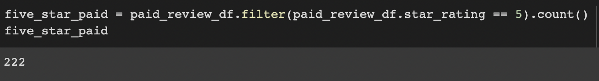

# Amazon_Vine_Analysis

## Overview of the analysis
The purpose of this project is to analyze Amazon reviews that have been written by members of the Amazon Vine program, a servie that allows manufactueres and publishers to receive reviews for their prodcuts. The analysis will help determine if there is any bias towards reviews from Vine members.

## Results
Out of all the reviews, the total amount of reviews created was 72587. 

### Vine reviews vs. non-Vine reviews.
When comparing the amount of Vine reviews, to non-Vine reviews, there was a drastic difference, with 64,355 more reviews being created by non-Vine users. A tlta of 613 Vine reviews were created, compared to 64,968.

### 5-star Vine reviews vs. 5-star non-Vine reviews.
Of the total number of reviews by both Vine and non-Vine users, a total of 222 5-star reviews were left by Vine users, compared to 30,543 being left by non-Vine reviewers.

### Percent of 5-star reviews vs. 5-star non-Vine reviews.
When looking at the total number of five star reviews compared to the total amount of reviews left, 36.2% of Vine reviewers tended to leave 5 stars, compared to 47% of non-Vine reviewers, who left 5-stars.

## Summary

With 47% of all reviews benig 5-stars from non-Vine reviewers, compared to only 36% from Vine reviewers, there is a clear positivity bias towards the non-Vine users. There are also significantly more users who are not part of the Vine progam as well. When looking at the amount of reviews created by both sets of users, it would not be recommended to continue being part of the Vine program. 

One additional source of analyais that could be used to support the statement would be the ability to take a statistical summary of the reviews, seeing what the overall mean is for each reviewer type.
